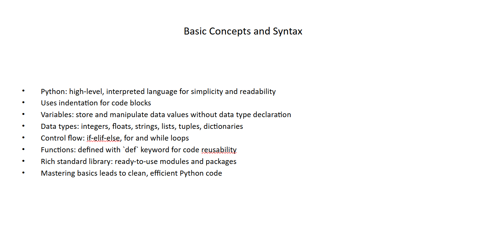
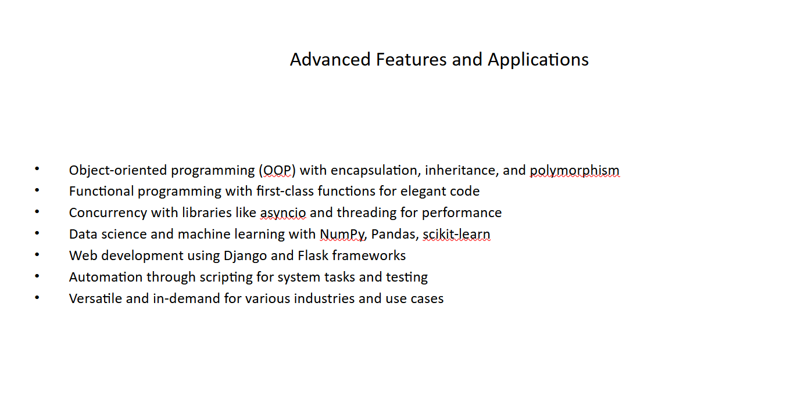

# presentation-creator

Easily create a PowerPoint without putting in the work.

## Table of Contents

1. [Introduction](#introduction)
2. [Installation](#installation)
3. [Configuration](#configuration)
4. [Usage](#usage)
5. [Contributing](#contributing)
6. [License](#license)

## Introduction

Welcome to my presentation creator. I created that as I got sick of writing bullet points and adding them to my PowerPoint presentations.  

## Installation

To use the creator you must clone this repo and install the requirements.

```bash
# Example installation instructions
git clone https://github.com/Niklas-dev/presentation-creator.git

# Create a python venv
python -m venv venv

# Install dependencies
pip install -r requirements.txt
```

## Configuration

Before you can run the project you must get get a OpenAI API key, which is free (limited usage). Add the API Key to the env as described below. You must also create an output foler in the root dir, after execution your pptx file and script will be in there.

```bash
# Create a .env file
touch .env
# Add configuration variables
OPENAI_API_KEY=sk-this-is-a-cool-fake-api-key
```

## Usage

After installing the dependencies you can run the main script with the additional params. All params must be defined. Enter your topic(--topic), you desired sub topics (--subtopics_amount) and the length of the presentation (--length_minutes)

```bash
# Example usage
py .\main.py --topic Water --subtopics_amount 5 --length_minutes 10
```

## Examples

Here you can see an example output for the topic Python Programming Language, two sub topics and 5 min length.

Slide One


Slide Two


```bash
# Example usage
py .\main.py --topic Water --subtopics_amount 5 --length_minutes 10
```


## Contributing

Feel free to contribute or report any issues or wanted features.

```markdown
# Contributing

1. Fork the project
2. Create your feature branch (`git checkout -b feature/YourFeature`)
3. Commit your changes (`git commit -am 'Add some feature'`)
4. Push to the branch (`git push origin feature/YourFeature`)
5. Create a new Pull Request
```

## License

Specify the project's license.

```
MIT License
```
